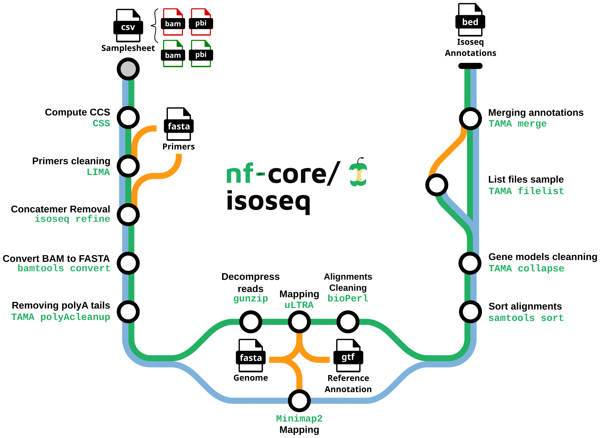

#  

[](https://nf-co.re/isoseq/results)
[](https://zenodo.org/badge/latestdoi/499464196)

[](https://www.nextflow.io/)
[](https://docs.conda.io/en/latest/)
[](https://www.docker.com/)
[](https://sylabs.io/docs/)
[](https://tower.nf/launch?pipeline=https://github.com/nf-core/isoseq)

[](https://nfcore.slack.com/channels/isoseq)[](https://twitter.com/nf_core)[](https://www.youtube.com/c/nf-core)

## Introduction

**nf-core/isoseq** is a bioinformatics best-practice analysis pipeline for Isoseq gene annotation with uLTRA and TAMA. Starting from raw isoseq subreads, the pipeline:

- Generates the Circular Consensus Sequences (CSS)

- Clean and polish CCS to create Full Length Non Chimeric (FLNC) reads

- Maps FLNCs on the genome

- Define and clean gene models



The pipeline is built using [Nextflow](https://www.nextflow.io), a workflow tool to run tasks across multiple compute infrastructures in a very portable manner. It uses Docker/Singularity containers making installation trivial and results highly reproducible. The [Nextflow DSL2](https://www.nextflow.io/docs/latest/dsl2.html) implementation of this pipeline uses one container per process which makes it much easier to maintain and update software dependencies. Where possible, these processes have been submitted to and installed from [nf-core/modules](https://github.com/nf-core/modules) in order to make them available to all nf-core pipelines, and to everyone within the Nextflow community!

On release, automated continuous integration tests run the pipeline on a full-sized dataset on the AWS cloud infrastructure. This ensures that the pipeline runs on AWS, has sensible resource allocation defaults set to run on real-world datasets, and permits the persistent storage of results to benchmark between pipeline releases and other analysis sources. The results obtained from the full-sized test can be viewed on the [nf-core website](https://nf-co.re/isoseq/results).

## Pipeline summary

1. Generate CCS consensuses from raw isoseq subreads ([`PBCCS`](https://github.com/PacificBiosciences/ccs))
2. Remove primer sequences from consensuses ([`LIMA`](https://github.com/pacificbiosciences/barcoding/))
3. Detect and remove chimeric reads ([`ISOSEQ3 REFINE`](https://github.com/PacificBiosciences/IsoSeq))
4. Convert bam file into fasta file ([`BAMTOOLS CONVERT`](https://github.com/pezmaster31/bamtools))
5. Select reads with a polyA tail and trim it ([`GSTAMA_POLYACLEANUP`](https://github.com/GenomeRIK/tama))
6. uLTRA path: decompress FLNCs ([`GUNZIP`](https://www.gnu.org/software/gzip/))
7. uLTRA path: index `GTF` file for mapping ([`uLTRA`](https://github.com/ksahlin/ultra))
8. Map consensuses on the reference genome ([`MINIMAP2`](https://github.com/lh3/minimap2) or [`uLTRA`](https://github.com/ksahlin/ultra))
9. Clean gene models ([`TAMA collapse`](https://github.com/GenomeRIK/tama))
10. Merge annotations by sample ([`TAMA merge`](https://github.com/GenomeRIK/tama))

## Quick Start

1. Install [`Nextflow`](https://www.nextflow.io/docs/latest/getstarted.html#installation) (`>=21.10.3`)

2. Install any of [`Docker`](https://docs.docker.com/engine/installation/), [`Singularity`](https://www.sylabs.io/guides/3.0/user-guide/) (you can follow [this tutorial](https://singularity-tutorial.github.io/01-installation/)), [`Podman`](https://podman.io/), [`Shifter`](https://nersc.gitlab.io/development/shifter/how-to-use/) or [`Charliecloud`](https://hpc.github.io/charliecloud/) for full pipeline reproducibility _(you can use [`Conda`](https://conda.io/miniconda.html) both to install Nextflow itself and also to manage software within pipelines. Please only use it within pipelines as a last resort; see [docs](https://nf-co.re/usage/configuration#basic-configuration-profiles))_.

3. Download the pipeline and test it on a minimal dataset with a single command:

   ```bash
   nextflow run nf-core/isoseq -profile test,YOURPROFILE --outdir <OUTDIR>
   ```

   Note that some form of configuration will be needed so that Nextflow knows how to fetch the required software. This is usually done in the form of a config profile (`YOURPROFILE` in the example command above). You can chain multiple config profiles in a comma-separated string.

   > - The pipeline comes with config profiles called `docker`, `singularity`, `podman`, `shifter`, `charliecloud` and `conda` which instruct the pipeline to use the named tool for software management. For example, `-profile test,docker`.
   > - Please check [nf-core/configs](https://github.com/nf-core/configs#documentation) to see if a custom config file to run nf-core pipelines already exists for your Institute. If so, you can simply use `-profile <institute>` in your command. This will enable either `docker` or `singularity` and set the appropriate execution settings for your local compute environment.
   > - If you are using `singularity`, please use the [`nf-core download`](https://nf-co.re/tools/#downloading-pipelines-for-offline-use) command to download images first, before running the pipeline. Setting the [`NXF_SINGULARITY_CACHEDIR` or `singularity.cacheDir`](https://www.nextflow.io/docs/latest/singularity.html?#singularity-docker-hub) Nextflow options enables you to store and re-use the images from a central location for future pipeline runs.
   > - If you are using `conda`, it is highly recommended to use the [`NXF_CONDA_CACHEDIR` or `conda.cacheDir`](https://www.nextflow.io/docs/latest/conda.html) settings to store the environments in a central location for future pipeline runs.

4. Start running your own analysis!

   ```bash
   nextflow run nf-core/isoseq --input samplesheet.csv --outdir <OUTDIR> --genome <GENOME NAME (e.g. GRCh37)> --primers <PRIMER FASTA> -profile <docker/singularity/podman/shifter/charliecloud/conda/institute>
   ```

## Documentation

The nf-core/isoseq pipeline comes with documentation about the pipeline [usage](https://nf-co.re/isoseq/usage), [parameters](https://nf-co.re/isoseq/parameters) and [output](https://nf-co.re/isoseq/output).

## Credits

nf-core/isoseq was originally written by Sébastien Guizard.

We thank the following people for their extensive assistance in the development of this pipeline:

- Thanks to [Jose Espinosa-Carrasco](https://github.com/JoseEspinosa), [Daniel Schreyer](https://github.com/DSchreyer) and [Gisela Gabernet](https://github.com/ggabernet) for their reviews and contributions
- [Kristoffer Sahlin](https://github.com/ksahlin) for `uLTRA` and the help he provided
- [Richard Kuo](https://github.com/GenomeRIK) ([Wobble Genomics](https://www.wobblegenomics.com/)) for his valuable advices on isoseq analysis
- The Workpackage 2 of [GENE-SWitCH Project](https://www.gene-switch.eu/) for their fruitful discussions and remarks
- [Mick Watson](https://twitter.com/BioMickWatson) group for their support
- The nf-core community for their help in the development of this pipeline
- [James A. Fellows Yates](https://github.com/jfy133) & nf-core for the metro map style components for pipeline graph

This pipeline has been developed as part of the GENE-SWitCH project. This project has received funding from the European Union's Horizon 2020 Research and Innovation Programme under the grant agreement n° 817998.

## Contributions and Support

If you would like to contribute to this pipeline, please see the [contributing guidelines](.github/CONTRIBUTING.md).

For further information or help, don't hesitate to get in touch on the [Slack `#isoseq` channel](https://nfcore.slack.com/channels/isoseq) (you can join with [this invite](https://nf-co.re/join/slack)).

## Citations

<!-- If you use  nf-core/isoseq for your analysis, please cite it using the following doi: [10.5281/zenodo.XXXXXX](https://doi.org/10.5281/zenodo.XXXXXX) -->

- [Isoseq3](https://github.com/PacificBiosciences/IsoSeq)
- TAMA: Kuo, R.I., Cheng, Y., Zhang, R. et al. Illuminating the dark side of the human transcriptome with long read transcript sequencing. BMC Genomics 21, 751 (2020). [10.1186/s12864-020-07123-7](https://doi.org/10.1186/s12864-020-07123-7)
- Minimap2: Li, H. (2018). Minimap2: pairwise alignment for nucleotide sequences. Bioinformatics, 34:3094-3100., Li, H. (2021). New strategies to improve minimap2 alignment accuracy. Bioinformatics, 37:4572-4574. [10.1093/bioinformatics/btab705](https://doi.org/10.1093/bioinformatics/btab705)
- uLTRA: Kristoffer Sahlin, Veli Mäkinen, Accurate spliced alignment of long RNA sequencing reads, Bioinformatics, Volume 37, Issue 24, 15 December 2021, Pages 4643–4651. [10.1093/bioinformatics/btab540](https://doi.org/10.1093/bioinformatics/btab540)
- Samtools: Danecek P, Bonfield JK, Liddle J, Marshall J, Ohan V, Pollard MO, Whitwham A, Keane T, McCarthy SA, Davies RM, Li H, Twelve years of SAMtools and BCFtools, GigaScience (2021) 10(2) giab008. [10.1093/gigascience/giab007](https://doi.org/10.1093/gigascience/giab007)
- MultiQC: Philip Ewels, Måns Magnusson, Sverker Lundin, Max Käller, MultiQC: summarize analysis results for multiple tools and samples in a single report, Bioinformatics, Volume 32, Issue 19, 1 October 2016, Pages 3047–3048. [10.1093/bioinformatics/btw354](https://doi.org/10.1093/bioinformatics/btw354)
- samtools: Danecek P, Bonfield JK, Liddle J, Marshall J, Ohan V, Pollard MO, Whitwham A, Keane T, McCarthy SA, Davies RM, Li H, Twelve years of SAMtools and BCFtools, GigaScience (2021) 10(2) [10.1093/gigascience/giab008](https://academic.oup.com/gigascience/article/10/2/giab008/6137722?login=false)

An extensive list of references for the tools used by the pipeline can be found in the [`CITATIONS.md`](CITATIONS.md) file.

You can cite the `nf-core` publication as follows:

> **The nf-core framework for community-curated bioinformatics pipelines.**
>
> Philip Ewels, Alexander Peltzer, Sven Fillinger, Harshil Patel, Johannes Alneberg, Andreas Wilm, Maxime Ulysse Garcia, Paolo Di Tommaso & Sven Nahnsen.
>
> _Nat Biotechnol._ 2020 Feb 13. doi: [10.1038/s41587-020-0439-x](https://dx.doi.org/10.1038/s41587-020-0439-x).
